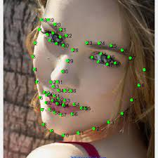
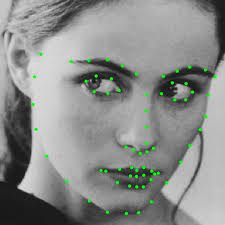
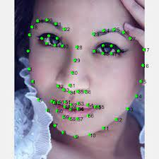

### 🎯 High-Resolution Facial Landmark Detection

<div align="center">
  
</div>


State-of-the-art **68-point facial landmark detection** using High-Resolution Networks (HRNet).

<p align="center">
  
  
  
</p>
---

## ✨ Features

- 🚀 **High-Resolution Networks:** Maintains high resolution throughout the process  
- 🎯 **68 Facial Landmarks:** Precise detection of key facial points  
- ⚡ **Real-time Performance:** Optimized for live video processing  
- 🔥 **Multi-Scale Fusion:** Advanced feature fusion across different resolutions  
- 📊 **Low NME Score:** Superior accuracy on 300W dataset
---

## Usage
**Datasets: [300W](https://ibug.doc.ic.ac.uk/resources/facial-point-annotations/)**
* Download the datasets from official sources.
* Download the annotations files from [OneDrive](https://1drv.ms/u/s!AiWjZ1LamlxzdmYbSkHpPYhI8Ms).


## 📈 Training
_**To train the model, run:**_
* Configure your dataset path in utils/config.py for training

```bash
$ python main.py --train
```

### Testing
_**For testing the model, use:**_

```bash
$ python main.py --test
```

### Real-Time Demo
**_To run the real-time facial landmark detection:_**
```bash
$ python main.py --demo
```
## 📊 Performance: 300W

| NME | *NME* |                      pretrained model                       |                           model                            |
|:--:|:-----:|:-----------------------------------------------------------:|:----------------------------------------------------------:|
|HRNetV2-W18 |  3.3  | [ImageNet](https://github.com/Shohruh72/HRNet-Landmarks/releases/download/v1.0.0/imagenet.pth) | [best.pt](https://github.com/Shohruh72/HRNet-Landmarks/releases/download/v1.0.0/best.pt) |


##### Reference
https://github.com/HRNet/HRNet-Facial-Landmark-Detection
